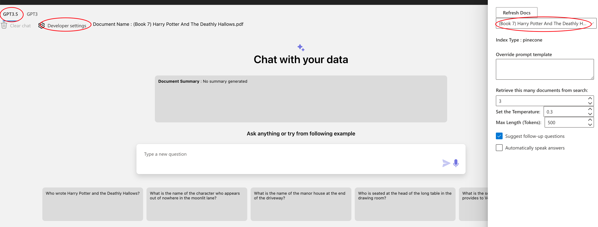
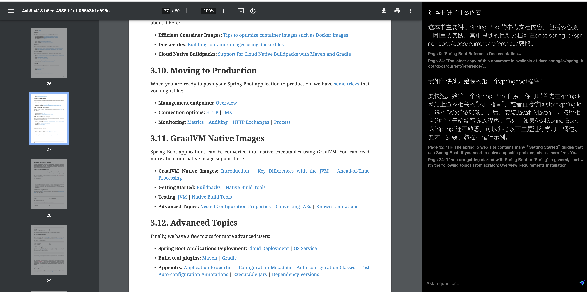
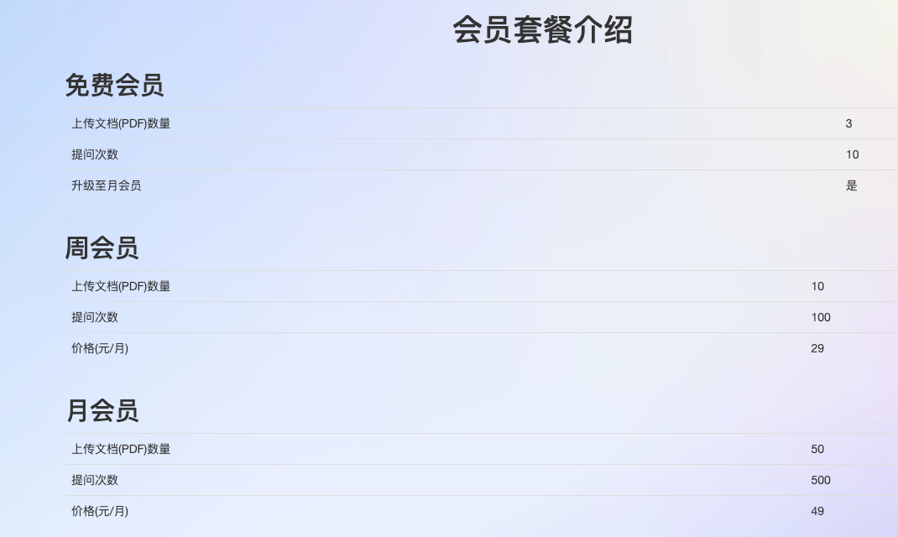

# ChatPDF介绍

我去年年底前读《k8s in action》这本书的时候，就想着要是ChatGPT能给我个大纲，我已问答的方式学习这本书，那效率可就高多了，但是我很意外，ChatGPT对于所有的书的内容都是一本正经的胡说八道。可能是因为版权原因或者一些别的原因吧。

最近很火的ChatPDF就是来解决这个需求的。**ChatPDF** 是一个能够从 PDF 文件中快速提取有用信息，并通过 ChatGPT 来解读这些信息的 AI 工具。

# 原理

ChatPDF首先读取PDF文件，将其转换为可处理的文本格式，例如txt格式。

接着，ChatPDF会对提取出来的文本进行清理和标准化，例如去除特殊字符、分段、分句等，以便于后续处理。这一步可以使用自然语言处理技术，如正则表达式等。

ChatPDF使用OpenAI的Embeddings API将每个分段转换为向量，这个向量将对文本中的语义进行编码，以便于与问题的向量进行比较。

当用户提出问题时，ChatPDF使用OpenAI的Embeddings API将问题转换为一个向量，并与每个分段的向量进行比较，以找到最相似的分段。这个相似度计算可以使用余弦相似度等常见的方法进行。

ChatPDF将找到的最相似的分段与问题作为prompt，调用OpenAI的Completion API，让ChatGPT学习分段内容后，再回答对应的问题。

最后，ChatPDF会将ChatGPT生成的答案返回给用户，完成一次查询。

# 实现案例

虽然原理很简单，但是自己写代码实现这个肯定是很大的工程了，最简单的方式那就是去github上找现成的。以下是我在github上找到的比较好的几个。

## [akshata29](https://github.com/akshata29)/**[chatpdf](https://github.com/akshata29/chatpdf)**

作者不但提供了代码还提供了在线demo的网站：https://dataaipdfchat.azurewebsites.net/

在设置里面还可以选择自己感兴趣的书：



使用了一下，真的很不错。

看了下启动需要Azure账号，[Azure](https://aka.ms/azure-dev/install)账号需要企业才能申请。放弃了这条路子。

## postor/*chatpdf*-minimal-demo

这个正如名字写的，就只是个demo，不能处理大量内容，好在代码量小，对于理解实现思路还是很有用的。虽然不会Python，但是我看了下还是觉得挺好。但是太过半成品。就不去优化他了。

## [Ulov888](https://github.com/Ulov888)/**[chatpdflike](https://github.com/Ulov888/chatpdflike)**

这个虽然看起来很简陋，但是该有的都有了。本地跑起来之后试用了下。也是不错的。我上传了springboot文档的前50页，它很快就分析完了，问了几个问题，也基本能答得出来。



又仔细看了下代码，它居然还在用```text-embedding-ada-002```这么笨的模型，怪不得答案笨笨的。我给更新了下，但是新模型上传文本变慢了，老是超时，也有点晚了，明天再搞。


# 总结

ChatPDF 实现思路不难，但是应用场景挺多，是一个很有价值的项目。

如果要测试的话，或者简单的做个线上网站来引流之类的，可以简单优化下第三个项目。快速上线。

如果想要走订阅模式的话，可以把第一个项目fork下来进行二次开发。第一个项目目前很活跃，站在巨人的肩膀上，工作量不会太大。

# 参考案例

http://www.chatspdf.cn/  这个就是英文版chatpdf的翻版，套餐模式。值得学习。

