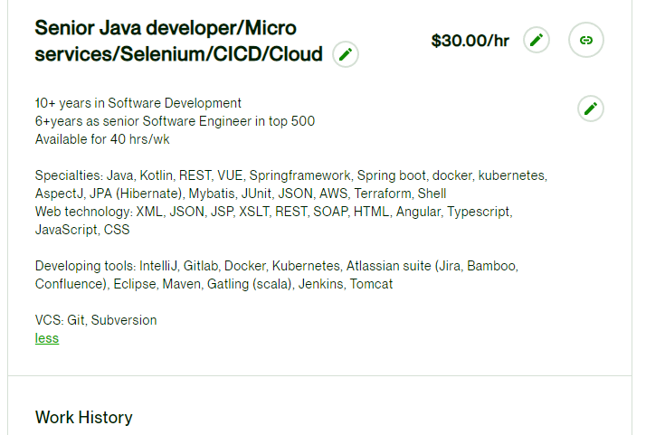
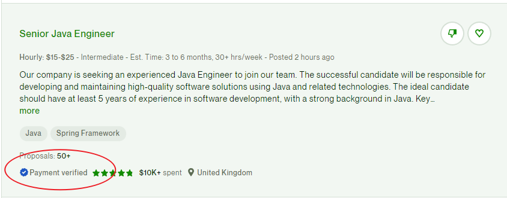

Upwork上手指南 如何在Upwork接单

大约两年前，在我供职的一家跨国公司，有位印度本地的同事即将离职。我感到非常惊讶，因为那时我们公司在印度提供的薪资水平相对较高，整体发展也相当稳定，而且当时疫情听严重的。我不禁好奇，难道是因为他有更好的职业机会，还是打算去米国闯荡？由于我们经常需要协作，关系也颇为融洽，于是我和他聊了聊。

在我们的谈话中，他告诉我，其实他已经在Upwork平台上接手项目一段时间了，而离职的原因正是打算全身心投入到Upwork上。那时，我第一次听说Upwork这个平台，随后我对其进行了深入研究，发现这确实是一个非常具有吸引力的职业发展平台。

### 了解Upwork平台

Upwork是一个包罗万象的平台，向全球各地的企业、机构、专业人士以及个人敞开开放。

> 不管你是来自澳大利亚的图形设计师，印度的网站开发者，还是英国的作家，提供写作服务，Upwork都欢迎你的加入。Upwork就像是一个无国界的地球村，一个顶尖的在线工作和协作平台。

在Upwork上，你可以找到形形色色的工作，比如写作、设计、编程等。平台涵盖了12个大类技能需求和上百个小类，应有尽有，满足各种类型的工作需求。具体12个大类是：

1. Web、Mobile&Software Dev – 网站，移动和软件开发；
2. IT&Networking – IT和网络；
3. Data Science&Analytics – 数据科学和分析；
4. Engineering&Architecture – 工程和建筑；
5. Design&Creative – 设计和创意；
6. Writing – 写作；
6. Translation – 翻译；
7. Legal – 法律；
8. Admin Support – 行政支持；
9. Customer Service – 客户服务；
10. Sales&Marketing – 销售和市场营销；
12. Accounting&Consulting – 会计和咨询。

Upwork上的工作有长期和短期的，有些工作是一次性的，也有些工作可能需要长期合作。长期的也有一些要求每周20小时或者更灵活的时间的，把它当做一个兼职的平台也是一个不错的选择。

### 准备工作

第一步是注册。一般来说注册没有什么大问题。 但是我还是建议在填写个人介绍的时候，要有新意，最好是在过往真实经历的基础上，适当突出自己的特别之处。这个就和个人简历一样，越有亮点越容易被别人注意到。

头像最好用自己真实的照片，英文名起一个自己喜欢的，需要注意的是如果客服认为你涉嫌使用假身份，可能会导致封号。

至于简历完成度，有人认为应做到100%后开始接单。其实这一点见仁见智，从雇主角度，他会更加倾向从过往经历以及已有成单评价判断是否合适。但没接到单之前，你的评价与 Portfolio 是没法填写的。与其硬凑100%, 反而不如尝试去接单，完成后再进行补充，磨刀不误砍柴工。

如果你暂时想不出什么合适的个人简介，建议直接去找几个你感兴趣的工作类别中接单较多的人（可以在Upwork上搜索），然后参考他们的介绍，进行简化和改进。这样既省时又省力。

下面是我当时写的简介和报价，经历就不放了，可以参考下

### 找到适合你的项目

注册完之后就是找到适合的项目了，在Upwork上，项目需求五花八门。工作有长期和短期的，有些工作是一次性的，也有些工作可能需要长期合作。你需要筛选出与您技能匹配的项目。以下是一些建议：

1. 搜索关键词：使用与您专业技能相关的关键词进行搜索，例如“Python”、“Web开发” “爬虫” “ 设计”等等。
2. 使用过滤器：利用Upwork平台提供的过滤器功能，根据项目预算、类型、时长等进行筛选。
3. 关注行业趋势：了解市场需求，关注热门技术和行业动态，以便抢占先机。

#### 找项目最重要的一点

和所有的中介平台一样，Upwork上的骗子也不少，一定一定要找有 **Payment verified**标签的工作 。而且在你没有积累很多的经验的情况下，一定一定不要在平台外交易。

###  如何成单

找到合适的项目之后，Upwork 上投标需要消耗一些点数。这些点数注册后是固定的，如果全部用完，就需要花费额外money 购买。

其实我在初次接单时，也没有很顺利。投递后很多家都石沉大海。点数快要清零，有些绝望的时候，有个美国的雇主终于给了回复。

项目本身很简单，就是写个爬虫抓取某个电商网站上某一些商品的评论，把数据结构化之后，存到Excel。不得不说国外的电商网站风控是真的差，我没有用代理IP，只加了最简单的策略，1秒爬5条，爬了很久也没被风控。

因为我不太会Python是用Java写的，java项目运行起来略麻烦，我就把运行程序打包成了一个Docker Iamge交付给了雇主，源码用邮件发给了雇主。前前后后一共花了大概6个小时，然后赚到了第一个$90,算时薪不算太高，但是其实闲着也赚不到钱，当时觉得也还可以。

再后来又投了很多，甚至点数都耗完了，都没有接到下一单。无奈之下我联系了前面的印度同事，他去的团队刚好有一个比较小的task给了我（当时不想跟着他做长期项目）。

这一单雇主给出了很高的评价，然后第一单的雇主也加了评价，后来可能是因为一些人看到了我的简历和评价，开始陆续有人邀请我，了解他们进行的项目。当时我当时在做自己的一些项目，没有很多的时间，也就都拒绝掉了。

### 注意事项

接单的全流程中，会有些当时注意不到，但后来发现应提前准备的地方。简单提一下，也给大家提个醒。

- 投标时不要过于笼统的介绍，体现出你能为这个项目带来什么，你的优势在哪里。此外，尽可能在项目出现的第一时间投标，被邀请进入下一步的可能性会提高
- 接到第一单后，会有一段时间让你完成个人认证。认证需要视频面对面沟通，如果你的信息正常，客服不会过多为难你。而认证完成后，你的简历中就会出现星型标记，代表平台对你的初步认可，也会增加你的投标成功几率
- 也许你的英语水平无法很流畅，但如果逻辑清晰，对方能够理解你的思路。这时候，你的专业度便会使你脱颖而出。
- 从雇主来看，最关心工作是否能够如期按质量完成，因此在沟通时，你应该设法打造出专业的形象，并为其提供专业性的意见。

### 主观感受

最后说一点我的主观感受吧。

第一个是价格。Upwork上的任务、工作价格在全球化环境中来看是不算太高的，如果你的水平在美国可以拿到Senior Engineer的offer，那在Upwork可能也就只能达到Medium Engineer的收入。 但是好处就是Upwork是不限工作地点的，我的印度本地同事拿着$40/小时（做了差不多一年之后的价格），在印度生活水平直接起飞。赚$在国内花虽然没有在印度爽，但也还是一个不错的选择。也有很多大神做到了$60-80/小时。

第二个是要不要长期做。我在Upwork只做了两单，一个原因就是当时有一些自己的事情，时间不是很充裕。另外一个原因也是主要原因，是因为当时我的全职工作是居家办公的，本来就很少见到同事了，业余时间再做一个远程是项目，对心理健康也不是很好。如果你打算长期做Upwork这种长期的远程项目，最好是有一个良好生活习惯。如果你暂时失业了，或者是想体验一下旅居，Upwork就是一个很好的选择。

第三个是如何入门。可能很多小伙伴们很担心自己的英语能不能顺畅的和老外交流。我的建议是，如果你不去尝试那么你永远不会从0-1。我本人英语就是四级擦线过的水平，在外企工作经常有印度或者美国的同事直接用视频会议软件打电话过来沟通工作和需求，一开始我听不懂别人讲的，别人也听不懂我将的，我就只能打开有道词典，输入中文给同事看机翻的英文，当时太囧了，也非常感激同事能一边讲一边给我打字。那时候我每天就反复去听视频会议录音，在这种“尴尬”“高压”的环境下，大概一个半月我就能磕磕巴巴的和同事用英语交流了。这个效率比我从小学到大学学英语高了几百倍。回到Upwork，如果你要学习实用英语，那Upwork就是最真实的场景了。请地道的外教需要大概需要120元/小时，而在Upwork沟通是全免费的。

第四个是认准他们的网站：https://www.upwork.com/。不需要任何的额外的第三方服务，不需要任何第三方介绍Upwork的工作，尤其是翻译工作。我在写这篇之前想搜一下别人的文章找找素材，结果看到一堆中介（骗子）发的帖子，国内的互联网环境，dddd。

最后，不管你是需要一个过渡还是想要逃离内卷的职场，都祝你成功~