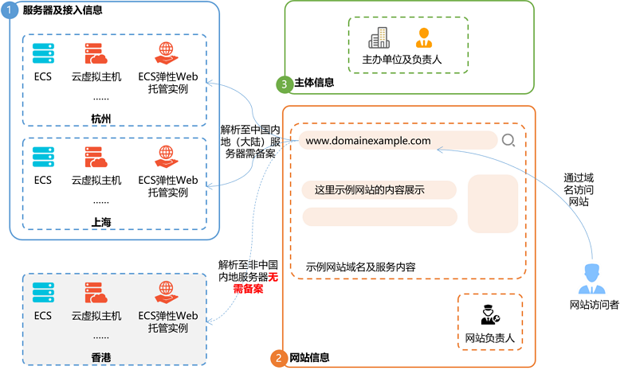
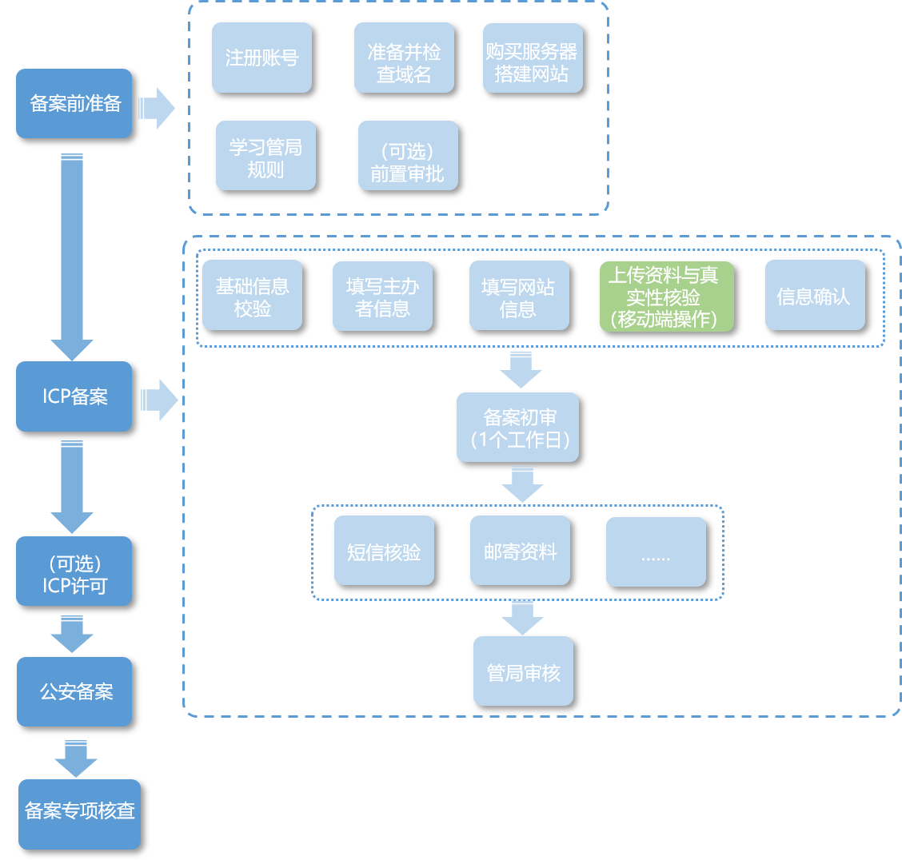
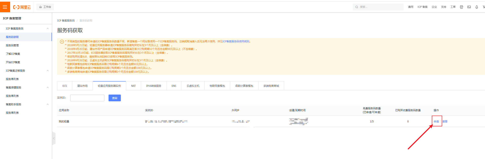

###  个人网站如何备案（0花费）

> 根据《非经营性互联网信息服务备案管理办法》，在中华人民共和国境内提供非经营性互联网信息服务，应当办理备案。未经备案，不得在中华人民共和国境内从事非经营性互联网信息服务。而对于没有备案的网站将予以罚款和关闭。

不管是做AI相关的教程，还是做新媒体运营，甚至是做UPWork兼职，个人站的重要性都是不言而喻的。来自搜索的自然流量是最便宜且最持久的流量。现在建站最简单且自由度最大的方式就是在国内的云服务厂商购买云主机和DNS解析服务。

之前有在国外的VPS服务器上做过尝试，因为那个时候还不支持个人网站备案，代备案少说也是五千块往上。虽说国外的服务器上建站不需要备案，但对网站的访问速度远不如国内的效果好。打算长期运行的合法的非营利性网站，还是建议使用国内的服务器。



### 首次备案流程说明

下面我以我申请的阿里云服务器举例说明个人网站备案流程及注意事项。其它的云服务器提供商步骤类同。

最近阿里云的服务器折扣也是相当大，我买了一台2核2G的一年才108元（平时大概要700元左右），个人站或者工具站足够了。[点击直达](https://www.aliyun.com/activity/new/index?userCode=b7h1qlgs),申请服务器。如果已经薅过的也可以跟我一样用亲戚朋友的账号薅。

### 1. 备案所需时长

整个备案流程预计所需时长约1~22个工作日左右，具体时长以实际操作时间为准。

### 2. 个人非营利性网站备案

**备案要求**：需要准备所需的可备案服务器，已实名域名、主办单位和备案负责人资料，用于后续管局审核存案。

**提交申请**：可通过服务器提供商（如阿里云、腾讯云、华为云等）或网络提供商（自建服务器的选择）申请提交备案申请。

这里说下在阿里云点击备案之后有几个选项，前面的是交钱代办理，后面的是自己办理。这里就选免费的自己办理，因为实际上整个过程也不麻烦。

**备案流程**：填写信息 → 人脸核验 → 阿里云初审 → 短信核验 → 管局终审 → 备案后处理



### 3. 填写信息

所需提交的个人网站备案证件资料（身份证件）建议都使用身份证，主办单位=网站负责人=主体负责人

后续步骤需要在手机端下载阿里云APP，方便身份照片拍照上传及人脸核验。

- **个人信息、网站负责人、主办单位负责人信息**和身份证照片按流程提示填写即可，手机号码都填写自己的同一个注册手机号。
- **备案地域选择**：根据你个人的身份证所在地、或实际居住地选择备案提交的地域。是否允许跨省备案，需以各地管局要求为准。
- **网站信息，大部分人备案订单未通过初审就是因为卡到这一步**

####  网站名称

- 网站名称不能是纯数字、纯英文、不能包含特殊符号或敏感词汇（反腐、赌博等）。
- 个人网站名称不能以域名、姓名命名，不能包含公司、组织等类型的字眼。
- 网站名称需能体现网站内容，不可超出主体权限范围。
- 网站名称要求三个字以上（含三个字）。

#### 个人网站名称要求

- 个人名义主办的网站类型主要有：工作经验分享（技术、学术研究等）、摄影作品分享、个人生活感悟记录等，尽量贴近网站内容，但不可超出个人权限范围。
- 网站名称处请填写网站开办后准备使用的名称，不能包含个人姓名、地名，不能是纯数字或字母组成，不能包含特殊符号，也不宜使用简称（至少在4个汉字以上），更不宜使用XXX工作室类似的格式命名网站（网站名称中包含xxx企业、集团、有限公司、资讯、生产中心、科技、贸易、协会、俱乐部、合作社、工作室等字样），对应备案主体均不能填写个人信息。
- 若包含新闻、出版、教育、医疗保健、药品和医疗器械、电子公告服务（社区、论坛）、博客、文化、广播电影电视节目等字样请联系相关主管部门，确定是否需办理前置或专项审批手续。

- **网站内容**：其它
- **服务类型**：一般都是网站应用服务
- **备注**：说明该网站的目的和用途，字数不少于20字。我填的这个，感觉是万能的。
  
  > 非经营性网站，主要用于生活、学习、职场上的个人心得记录，形成有益的分享，促进共同成长。

#### ICP 备案服务码

这里重点讲一下。如果你买的服务器/服务不在阿里云，或者不在当前账号。那么就选不到实例ID。我用的家人的账号嫖的新用户福利主机，域名是很久以前买的，在自己的账号。这里可以选择**ICP 备案服务码**进行备案。

**ICP 备案服务码**在阿里云购买100元/个。但是，如果你又云主机，可以在云主机的界面免费获得五个**ICP 备案服务码**。立省100元有木有。



### 4. 人脸核验

根据提示，使用阿里云APP进行核验即可。确认无误后提交备案订单。

### 5. 阿里云初审

提交备案申请后，阿里云备案审核专员会对备案信息初步审核。只要注意按照我上述的提示填写网站信息，一般工作日几个小时内都能通过。

稍后收到阿里云短信提醒备案订单已经提交至管局审核。

### 6. 短信核验

备案订单提交至管局审核时，会收到工信部短信通知，根据提示访问工信部ICP备案网站进行短信核验。

收到的短信通知后，根据里面的验证码和核验链接，登录工信部官网短信核验页面，输入信息后即提示【尊敬的ICP用户：您的短信核验已全部完成，该请求将提交管局审核。】

### 7. 管局终审

原则上，管局审核时间不超过10天。

备案通过后，就能获得ICP备案号了。

### 8. 备案后处理

网站备案通过后下一步如何操作？

网站备案通过后，你需要将获得的ICP备案号放置在网站首页下方，并链接至[工信部备案网址](https://link.zhihu.com/?target=http%3A//www.beian.miit.gov.cn/) [http://www.beian.miit.gov.cn](https://link.zhihu.com/?target=http%3A//www.beian.miit.gov.cn/) 供用户查询。

备案号如何添加放在网站底部？一般使用html的a标签，例如使用以下代码添加：

```html
<a href="http://www.beian.miit.gov.cn/">备案号</a>
```

如果网站后台或主题带有相关备案号设置功能，直接按格式填写备案号信息即可。

最后，恭喜你也有了一个完整的网站。